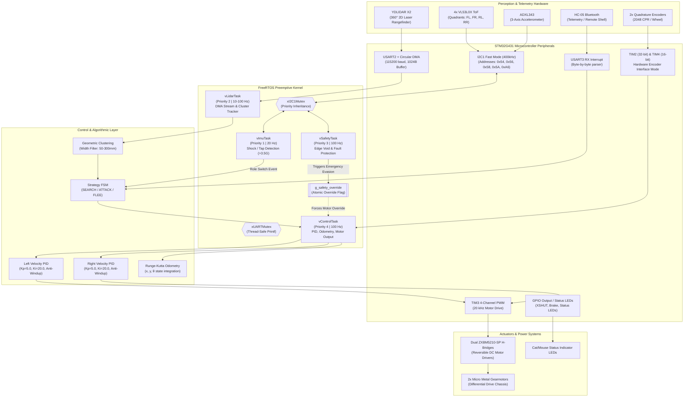
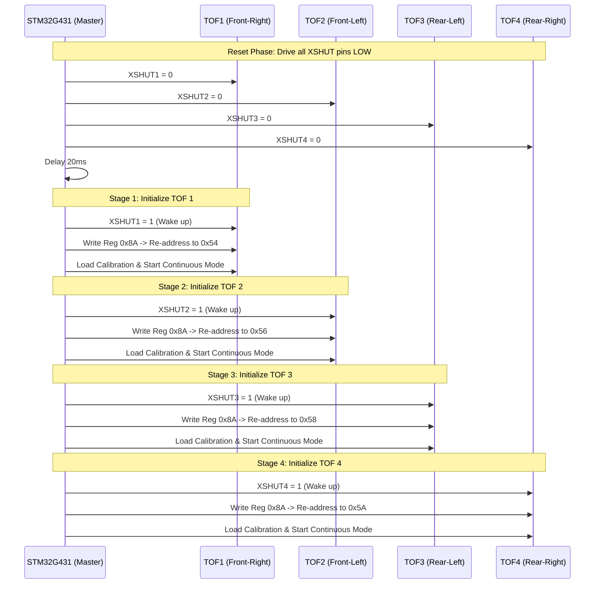
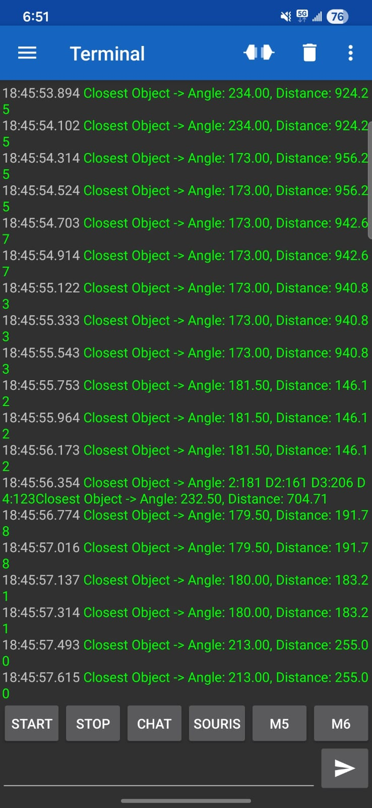

# 🐱 HellKitty — Autonomous Combat Mobile Robot
### High-Performance Embedded Robotics Platform: STM32G431 (ARM Cortex-M4F @ 170MHz) | FreeRTOS Real-Time Architecture | Custom 4-Layer PCB

<p align="center">
  
</p>

<p align="center">
  <a href="https://www.st.com/en/microcontrollers-microprocessors/stm32g431cb.html"></a>
  <a href="https://www.freertos.org/"></a>
  <a href="https://www.kicad.org/"></a>
  <a href="#"></a>
  <a href="LICENSE"></a>
</p>

---

## ⚡ Executive Engineering Summary

**HellKitty** is an industrial-grade autonomous combat robot engineered for high-speed table-top arena navigation ("Cat & Mouse" adversarial game logic). Designed from bare silicon up to deterministic application-layer control, the platform combines custom **4-layer power/signal mixed PCB hardware**, **bare-metal C peripheral drivers**, and a **preemptive FreeRTOS real-time architecture**.

The robot executes simultaneous 360° laser perception (YDLIDAR X2 @ 115.2 kbps via DMA), 4-quadrant edge/void Time-of-Flight monitoring (VL53L0X @ 100 Hz), high-G collision detection (ADXL343 accelerometer), dual closed-loop velocity PID regulation (TIM2/TIM4 hardware encoder quadrature decoding @ 100 Hz), and dynamic state-machine tactical transitions under strict deterministic latency constraints.

```
+----------------------------------------------------------------------------------------------------+
|                                    HELLKITTY SYSTEM BENCHMARKS                                     |
+--------------------------+-------------------------------------------------------------------------+
| Core Frequency           | 170 MHz (ARM Cortex-M4F with hardware FPU & DSP instructions)           |
| Control Loop Frequency   | 100 Hz deterministic periodic execution (vTaskDelayUntil)               |
| Edge Safety Latency      | < 10 ms hardware-level emergency stop & auto-evacuation override        |
| LiDAR Data Stream        | Circular DMA buffer (1024 B) with zero-copy packet state-machine parser |
| Sensor Bus Topology      | I2C1 (Fast Mode 400 kHz) with FreeRTOS Mutex Priority Inheritance       |
| Dynamic Power Delivery   | 5.5V-12V input -> 5V @ 3A Buck (MP1475) -> 3.3V Low-Noise LDO (BU33SD5)  |
| Motor Control Drive      | Dual ZXBM5210-SP H-Bridges (3A peak, dynamic braking, 20 kHz PWM)       |
+--------------------------+-------------------------------------------------------------------------+
```

---

## 🏗️ System Architecture

The robot's firmware and hardware layers are decoupled through strict hardware abstraction and thread-safe real-time communication mechanisms:



---

## ⏱️ FreeRTOS Multitasking & Real-Time Scheduling

The firmware uses **FreeRTOS v10.3.1** with dynamic memory allocation, preemptive scheduling, and priority-inheritance mutexes to guarantee deterministic timing across all subsystems.

### Task Execution Matrix

| Task Name | Priority | Periodicity / Trigger | Stack Size | Shared Resources / IPC | Functional Responsibility |
| :--- | :---: | :---: | :---: | :---: | :--- |
| `vControlTask` | **4 (Highest)** | **100 Hz (10 ms)**<br>`vTaskDelayUntil` | 512 words<br>(2048 B) | Hardware Timers (TIM2/3/4), Target Speeds (`target_speed_lin_x`, `target_speed_ang_z`) | Reads wheel encoders, updates Runge-Kutta odometry, executes dual velocity PID loops with integral anti-windup, computes PWM duty cycles, and applies motor ramping. |
| `vSafetyTask` | **3 (High)** | **100 Hz (10 ms)**<br>Continuous Polling | 256 words<br>(1024 B) | `xI2C1Mutex`, `g_safety_override`, `STATUS_SOURIS_LED` | Polls 4x VL53L0X ToF range registers. If distance to table surface exceeds 200 mm (void/cliff detected), asserts atomic override flag, cuts motor PWM, and commands automated pivot-and-reverse escape trajectory. |
| `vLidarTask` | **2 (Normal)** | **10 Hz (100 ms)**<br>(DMA Polled @ 100 Hz) | 512 words<br>(2048 B) | `huart2` Circular DMA buffer, `xUARTMutex`, `g_target` | Processes raw bytes from circular DMA, validates packet headers (`0xAA 0x55`) and XOR checksums, performs geometric angle correction, clusters contiguous obstacle points, and tracks closest target. |
| `vImuTask` | **1 (Low)** | **20 Hz (50 ms)**<br>Periodic Delay | 256 words<br>(1024 B) | `xI2C1Mutex`, `Strategy_ToggleRole()` | Reads ADXL343 3-axis acceleration registers over I2C. Evaluates hardware `SINGLE_TAP` shock interrupt (>3.5G threshold) with 2000 ms debounce to switch between Cat (Predator) and Mouse (Prey) combat states. |

### Shared Resource Arbitration & Synchronization

```c
// Example: Thread-safe I2C bus acquisition with Priority Inheritance
if (xSemaphoreTake(xI2C1Mutex, portMAX_DELAY) == pdTRUE) {
    status = ADXL343_ReadAxes(&hi2c1, &accel_data);
    if (ADXL343_CheckShock(&hi2c1) && g_safety_override == 0) {
        shock_detected = 1;
    }
    xSemaphoreGive(xI2C1Mutex);
}
```

1. **I2C1 Bus Contention:** The `xI2C1Mutex` protects the single I2C peripheral shared between the 4x VL53L0X ToF rangefinders and the ADXL343 IMU. Priority inheritance guarantees that if the low-priority `vImuTask` holds the bus when `vSafetyTask` wakes up, `vImuTask` temporarily inherits Priority 3, preventing unbounded priority inversion.
2. **LiDAR Circular DMA Buffer:** Direct Memory Access on USART2 writes directly to a 1024-byte SRAM ring buffer without CPU interrupt thrashing. The task tracks hardware `CNDTR` counter offsets to parse complete frames asynchronously.
3. **Safety Override Interlock:** An atomic flag `g_safety_override` decouples normal FSM navigation from the anti-fall maneuver. When asserted, `vControlTask` suspends trajectory setpoints until the robot returns to safe bounds.

---

## 🖨️ Hardware Design & Custom 4-Layer PCB

The robot is built around a custom **4-layer impedance-controlled PCB** engineered in KiCad 9.0, optimized for high current density, low EMI, and clean power distribution.

<p align="center">
  
</p>

### PCB Layer Stackup (1.6 mm Total Thickness, FR4)

| Layer | Name | Type | Copper Thickness | Dielectric Spacing | Functional Allocation |
| :---: | :--- | :---: | :---: | :---: | :--- |
| **L1** | `F.Cu` (Top) | Signal | 35 µm (1 oz) | — | High-speed digital signals (SWD, USART, I2C, SPI), MCU breakout, sensor connectors. |
| **—** | Dielectric 1 | Prepreg (FR4) | — | 0.10 mm (\(\varepsilon_r = 4.5\)) | High capacitive coupling to ground plane. |
| **L2** | `In1.Cu` (Inner 1) | Power / Plane | 35 µm (1 oz) | — | **Continuous Solid Ground Plane (GND)** for unbroken return current paths and EMI reduction. |
| **—** | Dielectric 2 | Core (FR4) | — | 1.24 mm (\(\varepsilon_r = 4.5\)) | Structural core isolation. |
| **L3** | `In2.Cu` (Inner 2) | Power / Plane | 35 µm (1 oz) | — | **Power Distribution Plane (PWR)**: Split polygon pours for `+5V`, `+3.3V`, and `VBAT`. |
| **—** | Dielectric 3 | Prepreg (FR4) | — | 0.10 mm (\(\varepsilon_r = 4.5\)) | High capacitive coupling to bottom layer. |
| **L4** | `B.Cu` (Bottom) | Signal | 35 µm (1 oz) | — | High-current motor H-bridge power routing, thermal relief dissipation, and test points. |

### Component & Power Distribution Architecture

| Subsystem | Component / IC | Interface | Specifications & Operational Role |
| :--- | :--- | :---: | :--- |
| **MCU** | **STM32G431CBU6** (UFQFPN48) | SWD / STDC14 | ARM Cortex-M4F @ 170 MHz, 128 KB Flash, 32 KB SRAM, hardware FPU/DSP, CORDIC math unit. |
| **Step-Down Buck** | **MPS MP1475DJ-LF-P** | Switching Reg | 500 kHz synchronous buck converter converting 2S/3S LiPo battery (7.4V–11.1V) to a stable 5.0V @ 3.0A rail. |
| **Low-Noise LDO** | **ROHM BU33SD5WG-TR** | Linear Reg | High PSRR, ultra-low dropout linear regulator stepping down 5.0V to 3.3V for MCU core and analog peripherals. |
| **Motor Drivers** | **2x Diodes Inc. ZXBM5210-SP** | TIM3 PWM / GPIO | Reversible H-Bridge drivers (3V–18V, 0.85A continuous, 3.0A peak, SOIC-8EP) with dynamic braking and cross-conduction protection. |
| **LiDAR Sensor** | **YDLIDAR X2** | USART2 + DMA | 360° 2D triangulation laser rangefinder (8 Hz rotational scan frequency, 0.12m–8.0m range, 3 kHz sample rate). |
| **Cliff / ToF Array** | **4x STMicroelectronics VL53L0X** | I2C1 + 4x XSHUT | Time-of-Flight ranging sensors dynamically re-addressed (0x54, 0x56, 0x58, 0x5A) for four-corner table edge monitoring. |
| **IMU / Shock** | **Analog Devices ADXL343BCCZ** | I2C1 + INT2 | 3-axis ultra-low power digital accelerometer configured for `SINGLE_TAP` interrupt capture (>3.5G collision detection). |
| **Encoders** | **2x Quadrature Optical/Magnetic** | TIM2 / TIM4 | Dual-channel differential quadrature encoder feedback (2048 counts per wheel revolution in 4x mode). |
| **Telemetry / Comms**| **HC-05 Bluetooth Module** | USART3 @ 9600bd | Bidirectional UART telemetry bridge for real-time telemetry streaming and remote state control. |

### KiCad Schematic Sheet Index

The complete schematic design is partitioned into modular hierarchical sheets inside [`hardware/`](hardware/):

| Schematic Sheet | Source File | Description |
| :--- | :--- | :--- |
| **Root Top Sheet** | [`Projet_Robot.kicad_sch`](hardware/Projet_Robot.kicad_sch) | Top-level interconnections, hierarchical bus links, and module connectors. |
| **MCU & Clocks** | [`µcontrolleur.kicad_sch`](hardware/µcontrolleur.kicad_sch) | STM32G431 pinout, STDC14 debug connector, external 8 MHz crystal, bypass capacitors, and status LEDs. |
| **Power Regulators** | [`regulateurs.kicad_sch`](hardware/regulateurs.kicad_sch) | MP1475 buck regulator, BU33SD5 LDO, LC output filtering, reverse-polarity protection, and slide power switch. |
| **Sensor Array** | [`capteur.kicad_sch`](hardware/capteur.kicad_sch) | 4x VL53L0X ToF connectors with XSHUT lines, ADXL343 accelerometer layout, and YDLIDAR / HC-05 headers. |
| **Motor Driver 1 & 2** | [`moteur1.kicad_sch`](hardware/moteur1.kicad_sch) | Dual ZXBM5210-SP H-Bridges, flyback suppression capacitors, test points, and JST-XH encoder/motor connectors. |

---

## 💻 Low-Level Driver & Algorithmic Implementation

### 1. YDLIDAR X2 Circular DMA Driver & Packet Parsing

The LiDAR stream transmits continuous variable-length point frames at 115200 baud over `USART2`. To eliminate CPU byte-by-byte interrupts, DMA operates in circular ring-buffer mode (`LIDAR_DMA_BUFFER_SIZE = 1024`):

```c
// Zero-overhead ring buffer processing in vLidarTask
uint16_t pos = LIDAR_DMA_BUFFER_SIZE - __HAL_DMA_GET_COUNTER(huart2.hdmarx);
if (pos != old_pos) {
    if (pos > old_pos) {
        ydlidar_process_data(&lidar_dma_buffer[old_pos], pos - old_pos);
    } else {
        ydlidar_process_data(&lidar_dma_buffer[old_pos], LIDAR_DMA_BUFFER_SIZE - old_pos);
        if (pos > 0) ydlidar_process_data(&lidar_dma_buffer[0], pos);
    }
    old_pos = pos;
}
```

#### Frame Decoding State Machine & Validation
1. **Header Synchronization:** Scans for sequence `0xAA 0x55`.
2. **Header Parsing:** Reads Packet Type (`CT`), Sample Count (`LSN`), First Sample Angle (`FSA`), and Last Sample Angle (`LSA`).
3. **XOR Checksum Verification:** Computes 16-bit folded XOR checksum over the full packet structure and rejects corrupted frames:
   $$\text{Checksum} = \bigoplus_{i=0}^{N-1} \text{Word}_i$$
4. **Geometric Angle Correction:** Corrects triangulation parallax distortion for near-field obstacles:
   $$\theta_{\text{corrected}} = \theta_{\text{raw}} + \arctan\left(21.8 \cdot \frac{155.3 - d}{155.3 \cdot d}\right) \cdot \frac{180^\circ}{\pi}$$
5. **Spatial Clustering & Object Discrimination:** Contiguous points with spatial distance variation $< \Delta_{\text{thresh}}$ are grouped into object clusters. Physical width is computed via polar chord projection:
   $$W_{\text{object}} = 2 \cdot d_{\text{avg}} \cdot \tan\left(\frac{\theta_{\text{width}}}{2}\right)$$
   *Clusters with $50\,\text{mm} \le W \le 300\,\text{mm}$ and $d \le 1200\,\text{mm}$ are classified as adversarial robots; static wall boundaries and arena artifacts are filtered out.*

---

### 2. Multi-Device Dynamic I2C Bootstrapping (4x VL53L0X)

All four VL53L0X Time-of-Flight sensors power up with the identical default I2C address (`0x29 / 0x52`). The custom driver performs a deterministic hardware-timed bootstrap:



---

### 3. Closed-Loop Motion Control, Odometry & State Machine

```
              +-------------------------------------------------------------+
              |                      STRATEGY FSM                           |
              |       (SEARCH -> ATTACK [Cat] / FLEE [Mouse])               |
              +-------------------------------------------------------------+
                                   |                     |
                      v_lin (target_speed_lin_x)    v_ang (target_speed_ang_z)
                                   |                     |
                                   v                     v
              +-------------------------------------------------------------+
              |                DIFFERENTIAL KINEMATICS                      |
              |  ω_L = (v_lin - v_ang * L/2) / R                            |
              |  ω_R = (v_lin + v_ang * L/2) / R                            |
              +-------------------------------------------------------------+
                         |                                  |
                   Target ω_L                         Target ω_R
                         |                                  |
                         v                                  v
              +--------------------+             +--------------------+
              |  PID LEFT (Motor2) |             | PID RIGHT (Motor1) |
              |  Kp=5.0, Ki=20.0   |             | Kp=5.0, Ki=20.0    |
              |  Anti-Windup Clamped|             | Anti-Windup Clamped|
              +--------------------+             +--------------------+
                         |                                  |
                     PWM_Duty_L                         PWM_Duty_R
                         |                                  |
                         v                                  v
              +--------------------+             +--------------------+
              | TIM3 CH3/CH4 (PWM) |             | TIM3 CH1/CH2 (PWM) |
              +--------------------+             +--------------------+
```

#### Parallel PID Velocity Control with Anti-Windup
$$\text{Output}(t) = K_p \cdot e(t) + K_i \int_0^t e(\tau)\,d\tau + K_d \frac{de(t)}{dt}$$

To prevent integrator windup during motor saturation or abrupt stops:
$$\text{Integral}_{\text{clamped}} = \max\left(-\text{Max}_{\text{int}}, \min\left(\text{Max}_{\text{int}}, \text{Integral} + e(t) \cdot \Delta t\right)\right)$$

#### Runge-Kutta / Midpoint Odometry Position Integration
Wheel speeds \(\omega_L, \omega_R\) are converted to linear displacement at \(\Delta t = 10\,\text{ms}\):
$$v_{\text{robot}} = \frac{v_R + v_L}{2}, \quad \omega_{\text{robot}} = \frac{v_R - v_L}{L_{\text{track}}}$$
$$\Delta \theta = \omega_{\text{robot}} \cdot \Delta t, \quad \theta_{\text{mid}} = \theta_k + \frac{\Delta \theta}{2}$$
$$x_{k+1} = x_k + v_{\text{robot}} \cdot \cos(\theta_{\text{mid}}) \cdot \Delta t$$
$$y_{k+1} = y_k + v_{\text{robot}} \cdot \sin(\theta_{\text{mid}}) \cdot \Delta t$$
$$\theta_{k+1} = \theta_k + \Delta \theta \pmod{2\pi}$$

---

## 🛠️ Build, Flash & Deployment Guide

### Hardware Requirements
- **Target Hardware:** HellKitty Custom PCB (with STM32G431CBU6)
- **Debugger / Programmer:** ST-Link V2 / V3 or J-Link (via standard SWD STDC14 connector)
- **Power Supply:** 2S LiPo Battery (7.4V) or Benchtop Power Supply (7.0V–12.0V, 3A limit)

### Software & Toolchain Prerequisites
- **Toolchain:** `arm-none-eabi-gcc` (v10.3 or higher)
- **IDE:** STM32CubeIDE (v1.14.0+) or VS Code with Cortex-Debug / CMake
- **Flashing Tools:** `STM32CubeProgrammer`, `openocd`, or `st-flash`
- **Telemetry Visualizer:** Python 3.8+ (`pyserial`, `matplotlib`, `numpy`)

---

### Step-by-Step Compilation & Flashing

#### Option A: Using STM32CubeIDE (GUI)
1. Launch STM32CubeIDE and select `File -> Import -> Existing Projects into Workspace`.
2. Browse to the cloned `firmware/` directory and click **Finish**.
3. Select the build configuration (`Release` or `Debug`).
4. Click **Project -> Build All** (`Ctrl+B`).
5. Connect your ST-Link to the onboard STDC14 connector, then click **Run -> Run** (`Ctrl+F11`).

#### Option B: Using Command Line & OpenOCD (CLI)
```bash
# 1. Clone the repository
git clone https://github.com/ezer-soltani/HellKitty-Autonomous-Robot.git
cd HellKitty-Autonomous-Robot

# 2. Flash binary via OpenOCD with ST-Link
openocd -f interface/stlink.cfg -f target/stm32g4x.cfg \
        -c "program firmware/Debug/Firmware_Robot.elf verify reset exit"

# Alternatively, using STM32CubeProgrammer CLI:
STM32_Programmer_CLI -c port=SWD -w firmware/Debug/Firmware_Robot.bin 0x08000000 -v -rst
```

---

### Real-Time LiDAR Visualizer & Telemetry Setup

A custom Python polar visualizer is included in [`scripts/visualizer.py`](scripts/visualizer.py) for real-time laser point-cloud streaming over serial:

```bash
# Install visualizer dependencies
pip install pyserial matplotlib numpy

# Run the real-time visualizer (adjust port to your serial device, e.g. COM3 or /dev/ttyUSB0)
python scripts/visualizer.py
```

<p align="center">
  
</p>

### Remote Shell & Bluetooth Command Protocol

Connect via Bluetooth terminal (HC-05 @ 9600 baud) or ST-Link Virtual COM Port (USART1 @ 115200 baud):

| Command String | Firmware Handler | Action Performed |
| :---: | :--- | :--- |
| `START\n` | `Strategy_SetEnabled(1)` | Enables motor outputs and activates the Strategy FSM. |
| `STOP\n` | `Strategy_SetEnabled(0)` | Emergency stop: forces motor PWM to 0% and clears setpoints. |
| `CHAT\n` | `Strategy_SetRole(ROLE_CHAT)` | Manually sets combat mode to **Cat (Predator)**. Green LED on. |
| `SOURIS\n`| `Strategy_SetRole(ROLE_SOURIS)`| Manually sets combat mode to **Mouse (Prey)**. Red LED on. |

---

## 📂 Repository Structure

```
HellKitty-Autonomous-Robot/
├── firmware/                       # Embedded STM32 Firmware
│   ├── Core/
│   │   ├── Drivers/                # Custom Bare-Metal / HAL Component Drivers
│   │   │   ├── hc-05_bluetooth.c/h # Bluetooth command interpreter & telemetry
│   │   │   ├── imu.c/h             # ADXL343 I2C driver & shock interrupt config
│   │   │   ├── lidar.c/h           # YDLIDAR X2 DMA parser & object clustering
│   │   │   ├── motor.c/h           # H-Bridge PWM & hardware encoder interface
│   │   │   ├── odometry.c/h        # Runge-Kutta differential drive odometry
│   │   │   ├── pid.c/h             # Closed-loop velocity PID with anti-windup
│   │   │   └── tof.c/h             # 4x VL53L0X dynamic I2C bootstrap driver
│   │   ├── Inc/                    # Application Headers & Peripheral Configs
│   │   │   ├── FreeRTOSConfig.h    # Kernel configuration (Preemption, Heap, Priorities)
│   │   │   ├── main.h              # Pin definitions & hardware clock mappings
│   │   │   └── strategy.h          # FSM state declarations & game logic
│   │   └── Src/                    # RTOS Tasks & HAL Peripheral Initialization
│   │       ├── app_freertos.c      # FreeRTOS task implementations & mutex definitions
│   │       ├── main.c              # System initialization & clock tree setup (170MHz)
│   │       └── strategy.c          # Tactical FSM (SEARCH / ATTACK / FLEE)
│   ├── Drivers/                    # STMicroelectronics CMSIS & G4 HAL Drivers
│   ├── Middlewares/                # FreeRTOS Real-Time Kernel Source Code
│   ├── Firmware_Robot.ioc          # STM32CubeMX Hardware Configuration Project
│   └── STM32G431CBUX_FLASH.ld      # GCC Linker Script (Memory Map layout)
├── hardware/                       # KiCad 9.0 Electronic CAD Project
│   ├── Projet_Robot.kicad_pcb      # 4-Layer mixed-signal PCB layout
│   ├── Projet_Robot.kicad_sch      # Top-level hierarchical schematic
│   ├── µcontrolleur.kicad_sch      # STM32G431 MCU schematic sheet
│   ├── regulateurs.kicad_sch       # MP1475 buck & BU33SD5 LDO power regulators
│   ├── capteur.kicad_sch           # VL53L0X ToF, ADXL343 IMU, and sensors
│   ├── moteur1.kicad_sch           # ZXBM5210-SP motor driver H-Bridge circuit
│   └── Gerbers_hellokitty/         # Production-ready Gerber & Drill manufacturing files
├── scripts/
│   └── visualizer.py               # Python Matplotlib polar LiDAR real-time telemetry
├── docs/                           # Datasheets, Architecture Diagrams & Test Reports
│   ├── Firmware_Architecture.md    # In-depth architectural specification
│   ├── Tasks_FreeRTOS.md           # Task execution & priority analysis
│   ├── schema_arch.png             # System block diagram
│   └── YDLIDAR X2 Data Sheet.pdf   # Component datasheets
├── LICENSE                         # MIT License
└── README.md                       # Project Technical Showcase & Documentation
```

---

## 👨‍💻 Engineering Team & Contributors

Developed at **ENSEA** (Graduate School of Electrical and Computer Engineering) within the *Electronics & Embedded Systems (ESE)* department:

- **Ezer Soltani** — *Embedded Software & Firmware Lead (FreeRTOS, Drivers, Control & Odometry)* — [GitHub](https://github.com/ezer-soltani)
- **Aymen Ben Jemaa** — *Hardware & PCB Design Engineer (KiCad 4-Layer Board, Power Delivery)* — [GitHub](https://github.com/aymen-bj)
- **Serine Rouabah** — *Perception, Sensor Integration & Algorithm Development* — [GitHub](https://github.com/serine-rouabah)

---

## 📜 License

This project is licensed under the **MIT License** — see the [LICENSE](LICENSE) file for complete details.
