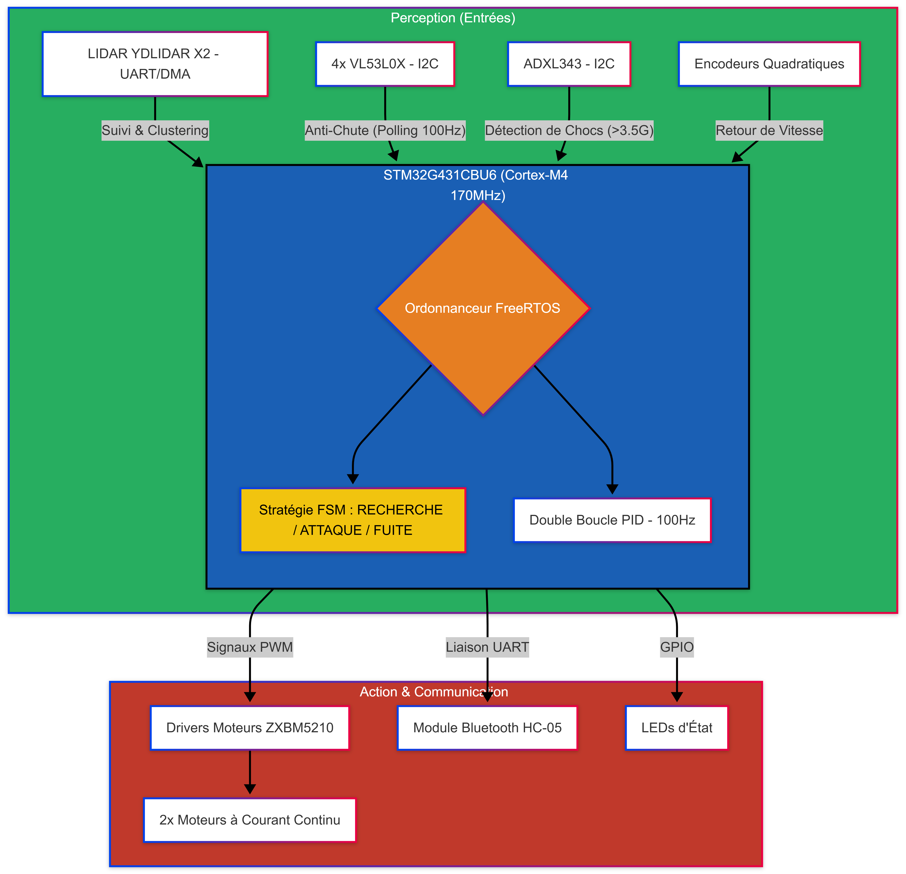

# Autonomous Mobile Robot with STM32 & FreeRTOS

  

## Project Overview
**HellKitty** is an autonomous combat robot designed for a real-time "Cat and Mouse" game on a tabletop arena. The system integrates advanced perception, precise motor control, and a robust multitasking architecture to navigate and react to its environment autonomously.

### System Architecture

## Key Features
- **Real-time Navigation:** Multitasking architecture for simultaneous sensor processing, control, and strategy.
- **Data Fusion:** Combined input from **YDLIDAR X2** and **4x VL53L0X TOF** sensors for robust obstacle detection and safety.
- **Proactive Safety:** Integrated anti-fall algorithms (sequence pivot) and high-G collision detection via IMU.
- **High Performance:** Powered by an **STM32G431** (Cortex-M4 @ 170MHz) with hardware FPU.

## Technology Stack
- **Microcontroller:** STM32G431CBU6
- **OS:** FreeRTOS
- **Language:** C (HAL/LL Drivers)
- **CAD:** KiCad (4-layer PCB)
- **Sensors:** Lidar (UART/DMA), TOF (I2C Polling), IMU (ADXL343)
- **Connectivity:** Bluetooth (HC-05) for telemetry and control.

## Hardware Specifications
The hardware is designed for reliability and high performance in a compact form factor.

  

- **Custom 4-layer PCB:** Optimized for high-speed signal integrity.
- **Microcontroller:** STM32G431CBU6 (Cortex-M4 @ 170MHz) with dedicated motor control timers.
- **Power Management:** Onboard Buck and LDO regulators for stable 3.3V and 5V rails.
- **Actuators:** 2x DC Motors with high-resolution quadratic encoders.

### Electronics Design
| Module | Schematic |
| :--- | :--- |
| **Control** |  |
| **Power** |  |
| **Motors** |  |
| **Sensors** |  |

## Firmware Architecture
The firmware leverages **FreeRTOS** for deterministic real-time scheduling:

| Task | Priority | Frequency | Role |
| :--- | :---: | :---: | :--- |
| **vSafetyTask** | MAX | 100Hz | High-priority TOF polling & fall prevention (Stop -> Pivot -> Advance). |
| **vControlTask** | Med | 100Hz | Speed PID loops, Odometry calculation, and Strategy FSM. |
| **vLidarTask** | Med | 10Hz | DMA-based Lidar parsing, object segmentation, and tracking. |
| **vImuTask** | Low | 20Hz | Shock detection (>3.5G) for role switching (Cat/Mouse). |

**Inter-task Communication:**
- **Semaphores & Mutexes:** Protect shared peripherals (I2C1, UART) from concurrent access.
- **DMA (Direct Memory Access):** Efficient background reception of Lidar data streams.

## Key Algorithms
- **PID Control:** Optimized `Kp=5.0, Ki=20.0` for motor velocity regulation.
- **Clustering:** Carthesian conversion and fusion of Lidar points (`MERGE_THRESHOLD = 150mm`).
- **Strategy FSM:** Dynamic role switching based on sensor inputs and collision events.

## Telemetry & Debug
Real-time monitoring is achieved via the HC-05 Bluetooth module, providing insights into sensor data, state transitions, and system health.

  

## Installation & Setup
1. Clone this repository.
2. Open the `firmware/` directory as an existing project in **STM32CubeIDE**.
3. Build the project and flash it to the STM32G431 target.
4. Use the `scripts/visualizer.py` for real-time Lidar data visualization (requires Python).

## Directory Structure
- `firmware/`: STM32CubeIDE project and source code.
- `hardware/`: KiCad schematics, PCB layout, and libraries.
- `docs/`: Technical datasheets, architecture diagrams, and project reports.
- `scripts/`: Telemetry and visualization tools.
